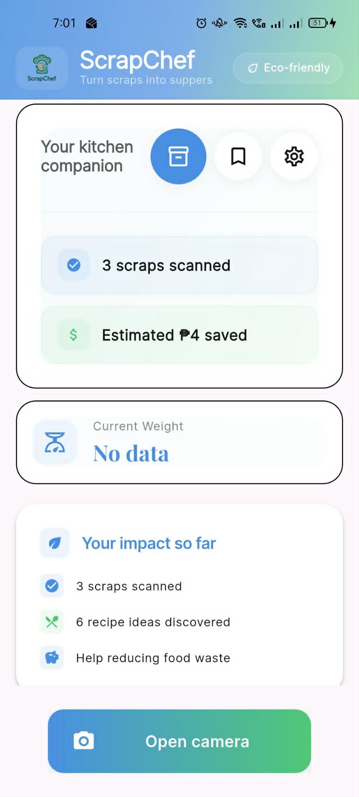
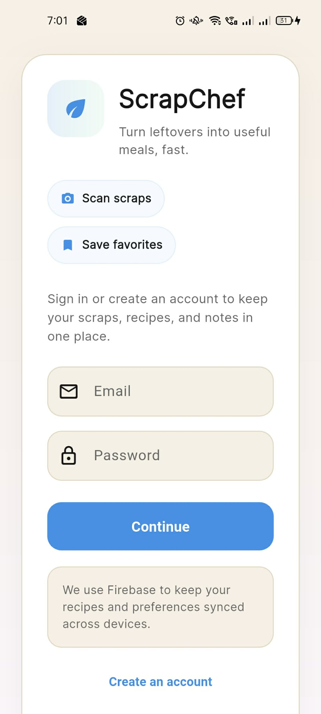
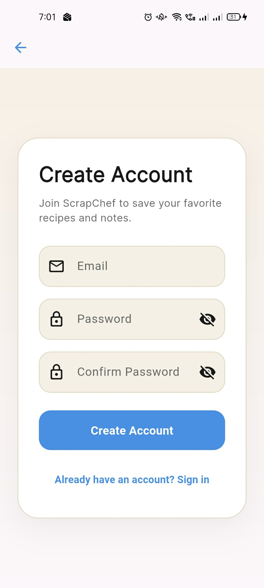
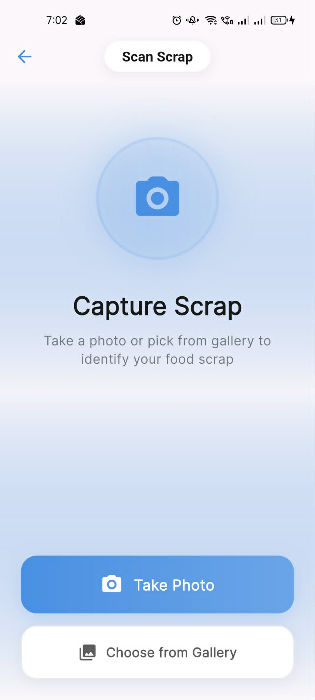
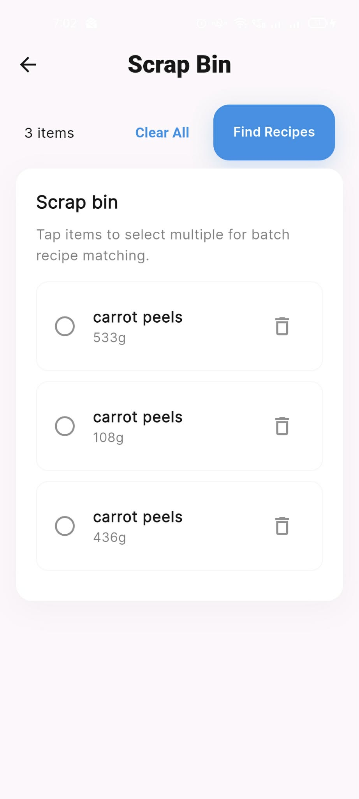
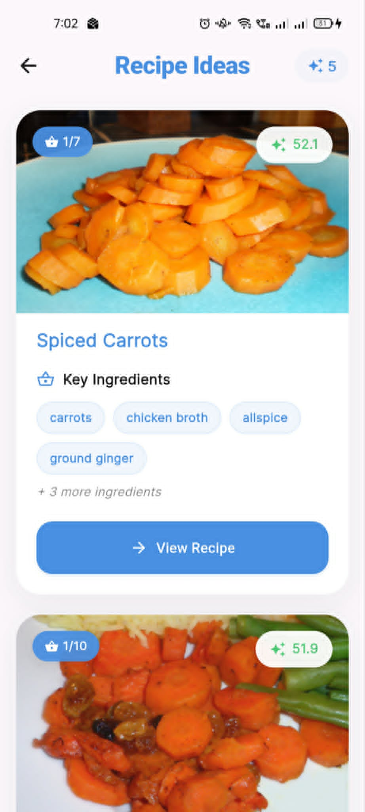
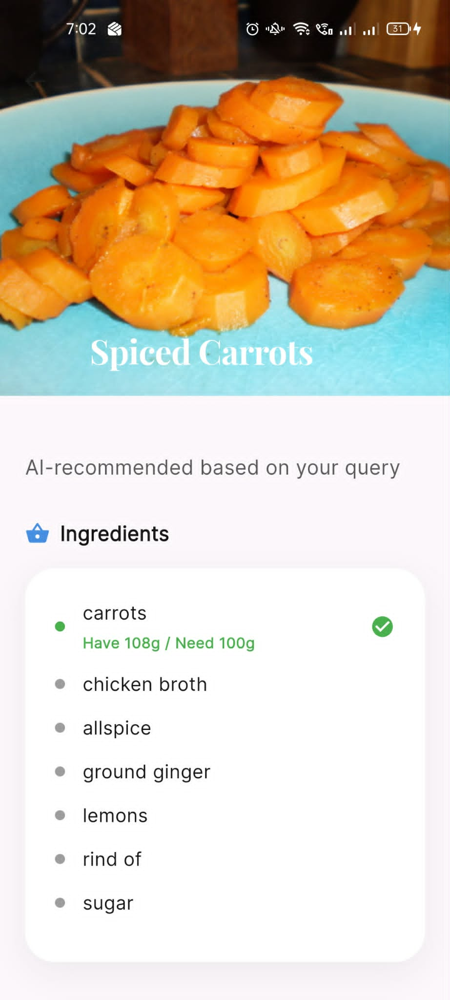
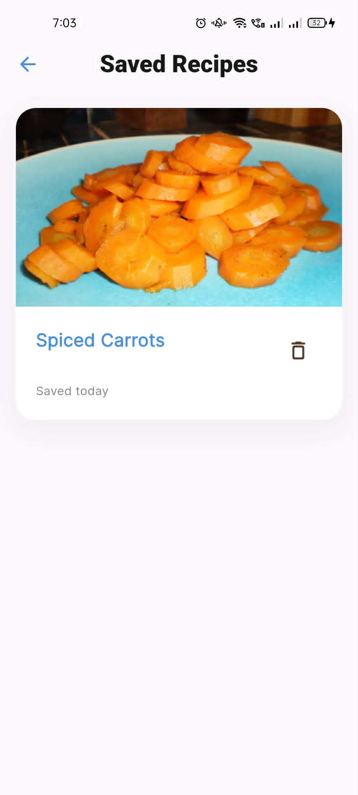
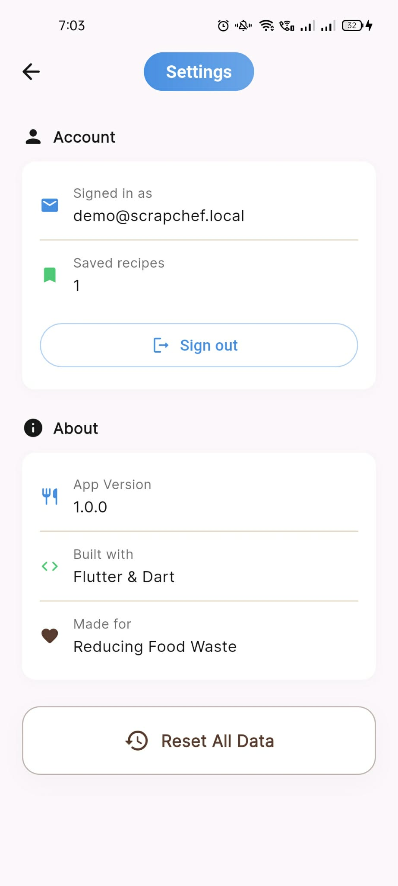

# ScrapChef

Turn your food scraps into delicious recipes with AI-powered recommendations. ScrapChef helps you reduce food waste by identifying food scraps from images and suggesting creative recipes based on what you have available.

## Features

- **📸 Smart Scrap Classification**: Use your camera to identify food scraps instantly
- **🍳 Recipe Recommendations**: Get personalized recipe suggestions based on your available scraps
- **📦 Inventory Management**: Track your scraps with weight tracking and save favorite recipes
- **💾 Cloud Sync**: Save recipes and scraps to Firebase for access across devices
- **⚖️ Weight Tracking**: Track ingredient weights with IoT device integration (optional)
- **🔍 Ingredient Matching**: See which ingredients you have for each recipe with weight availability

## Screenshots

### Main Page

The home screen showing your scrap statistics and quick access to scan, bin, and saved recipes.

### Login Page

Sign in to sync your scraps and recipes across devices.

### Create Account Page

Create a new account to start tracking your food scraps.

### Scan Scrap Page

Use your camera to identify food scraps from images.

### Scrap Bin Page

View and manage all your logged scraps with weight tracking.

### Recipe Ideas Menu

Browse personalized recipe suggestions based on your available scraps.

### Ingredients Page

See ingredient availability with weight matching for each recipe.

### Saved Recipes Page

Access your favorite recipes for quick reference.

### Settings Page

Configure app settings and manage your account.